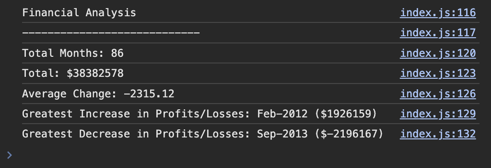

# Console Finances

This project serves to analyze and calculate financial records of a company using the provided dataset composed of arrays with two fields: Date and Profit/Losses.

## Task

The task is to write JavaScript code to calculate following and log information to the console:
- The total number of months included in the dataset.
- The net total amount of Profit/Losses over the entire period.
- The average of the changes in Profit/Losses over the entire period.
- The greatest increase in profits (date and difference in the amounts) over the entire period.
- The greatest decrease in losses (date and difference in the amounts) over the entire period.

## Technologies Used

- **Frontend:** JavaScript
- **Version Control:** Git

## Screenshot

## Link to Project

The live version of this project can be found [here](https://caseygirlyn.github.io/Console-Finances/).

## License

This project is licensed under the [MIT License](LICENSE).